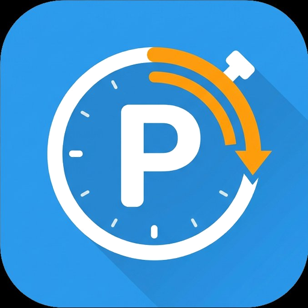

<p align="center">
  
</p>

<h1 align="center">ParkAlert</h1>

<p align="center">
  Free parking timer for supermarket car parks — with Android Auto support and German / English UI.
</p>

<p align="center">
  
  
  
  
</p>

---

> **DE:** Kostenloser Parkzeit-Timer für deutsche Einzelhandelsparkplätze (Lidl, Aldi, Rewe, …) mit Android Auto-Unterstützung und mehrsprachiger Oberfläche.
>
> **EN:** Free parking timer for supermarket car parks with Android Auto support and full multilingual (German / English) UI.

**Package:** `de.parkalert.app` &nbsp;|&nbsp; **Min SDK:** 26 (Android 8.0) &nbsp;|&nbsp; **Target SDK:** 34 &nbsp;|&nbsp; **Version:** 1.0

---

## Status

| Area | State |
|---|---|
| Core timer (phone) | Complete |
| Android Auto | Complete |
| German / English UI | Complete |
| Foreground service + notifications | Complete |
| Overtime tracking | Complete |
| GDPR / UMP consent (IAB TCF 2.2) | Complete |
| AdMob banner ads | Complete — **test IDs**, replace before publishing |
| Play Store release | Not yet published |
| Screenshots | Pending |

---

## Features

- Five quick-select buttons: **15 / 30 / 60 / 90 / 120 minutes**
- Full-screen countdown with colour feedback: Green → Yellow (10 min left) → Red (expired)
- Overtime counter after expiry with live notifications
- Timestamps for start time and expiry time shown on the timer screen
- Persistent foreground service — timer survives screen lock and app switch
- Alarm notification + vibration on expiry
- **Android Auto** integration (GridTemplate for selection + MessageTemplate for countdown) — no ads on Auto screens
- **Multilingual:** German (`de`) and English (`en`) — follows device language automatically
- **GDPR / DSGVO-compliant** AdMob banner ads with UMP consent dialog (IAB TCF 2.2)
- In-app privacy policy (offline, localised HTML)
- Settings screen: manage consent, view privacy policy, open-source licences

---

## Requirements

| | |
|---|---|
| Android | 8.0 (API 26) or newer |
| Android Auto | 8.x or newer (optional) |
| Permissions | `POST_NOTIFICATIONS`, `VIBRATE`, `FOREGROUND_SERVICE`, `INTERNET`, `AD_ID` |

---

## Build from source

### Prerequisites

- **JDK 17+** (Android Studio ships with JBR 21)
- **Android SDK** — API 34, Build-Tools 34, and the **Android Automotive OS** SDK extension

### Windows

```powershell
git clone https://github.com/<YOUR_USERNAME>/ParkAlert.git
cd ParkAlert
.\gradlew.bat assembleDebug
# APK → app\build\outputs\apk\debug\app-debug.apk
```

### Linux / macOS

```bash
git clone https://github.com/<YOUR_USERNAME>/ParkAlert.git
cd ParkAlert
chmod +x gradlew
./gradlew assembleDebug
```

### Install to connected device

```bash
.\gradlew.bat installDebug   # Windows
./gradlew installDebug       # Linux/macOS
```

---

## Multilingual Support

The app uses Android's standard i18n system — no manual language switcher needed. The UI follows the device language automatically.

| Locale | Folder | Status |
|---|---|---|
| English (default) | `res/values/` | Complete |
| German | `res/values-de/` | Complete |
| English (explicit) | `res/values-en/` | Complete |

### Adding a new language

1. Create `app/src/main/res/values-XX/strings.xml` (replace `XX` with the BCP 47 tag, e.g. `fr`).
2. Copy `res/values-de/strings.xml` as a starting point and translate each string.
3. Create a localised privacy policy: `app/src/main/assets/privacy_policy_XX.html`.
4. Add the filename to your locale strings:
   ```xml
   <string name="privacy_policy_asset">privacy_policy_XX.html</string>
   ```
5. Build and test on a device or emulator set to that language.

---

## AdMob Setup

### Current state (test IDs — development only)

| String resource | Value |
|---|---|
| `admob_app_id` | `ca-app-pub-3940256099942544~3347511913` |
| `admob_banner_main` | `ca-app-pub-3940256099942544/6300978111` |
| `admob_banner_timer` | `ca-app-pub-3940256099942544/6300978111` |

### Switching to real IDs before publishing

1. Create an [AdMob account](https://admob.google.com) and register the app with package `de.parkalert.app`.
2. Create two **Banner** ad units (main screen and timer screen).
3. In `app/src/main/res/values/strings.xml`, replace:

```xml
<string name="admob_app_id" translatable="false">ca-app-pub-YOUR_APP_ID</string>
<string name="admob_banner_main" translatable="false">ca-app-pub-YOUR_BANNER_ID_MAIN</string>
<string name="admob_banner_timer" translatable="false">ca-app-pub-YOUR_BANNER_ID_TIMER</string>
```

---

## GDPR / DSGVO Compliance

- First launch in the EEA: UMP consent dialog (IAB TCF 2.2) shown **before** any ad loads.
- Consent denied → non-personalised ads only. App fully functional without consent.
- Consent can be changed at any time: gear icon → **Privacy & Consent**.
- Offline privacy policies: `assets/privacy_policy_de.html` and `assets/privacy_policy_en.html`.
- No ads on Android Auto (Google policy).

See [`TESTING.md`](TESTING.md) for the full GDPR compliance checklist.

---

## Android Auto

1. Install **Android Auto** on your phone (Play Store).
2. Use the Desktop Head Unit (DHU) for testing:
   ```bash
   $ANDROID_SDK_ROOT/extras/google/auto/desktop-head-unit
   ```
3. Enable *Unknown sources* in Android Auto developer settings.
4. ParkAlert appears as a **Parking** app in the Auto launcher.

---

## Play Store Publishing Checklist

- [ ] Replace test AdMob IDs in `res/values/strings.xml`
- [ ] Configure GDPR message in AdMob Console (Privacy & messaging → GDPR)
- [ ] Add privacy policy URL in Play Console (App content → Privacy policy)
- [ ] Complete Play Console **Data safety** form (AdMob: device ID, usage data, approx. location)
- [ ] Test consent dialog with EEA geography simulation (see `TESTING.md`)
- [ ] Verify banner ads load on main screen and timer screen
- [ ] Verify no ads appear in Android Auto
- [ ] Test German UI on `de` device / emulator
- [ ] Test English UI on `en` device / emulator
- [ ] Add screenshots to Play Store listing
- [ ] Upload Play Store metadata from `playstore-metadata/` folder

---

## Project Structure

```
ParkAlert/
├── app/src/main/
│   ├── assets/
│   │   ├── privacy_policy_de.html         # German GDPR privacy policy (offline)
│   │   └── privacy_policy_en.html         # English privacy policy (offline)
│   ├── java/de/parkalert/app/
│   │   ├── ConsentManager.kt              # UMP / GDPR consent wrapper
│   │   ├── Constants.kt                   # Shared constants
│   │   ├── MainActivity.kt                # Duration selection + consent + banner ad
│   │   ├── TimerActivity.kt               # Countdown screen + banner ad
│   │   ├── TimerService.kt                # Foreground service (background timer)
│   │   ├── SettingsActivity.kt            # Settings: consent, privacy policy, licences
│   │   ├── PrivacyPolicyActivity.kt       # In-app localised privacy policy WebView
│   │   └── automotive/
│   │       ├── ParkAlertCarAppService.kt  # Car App entry point
│   │       ├── ParkAlertSession.kt        # Car session
│   │       ├── SelectDurationScreen.kt    # GridTemplate (Auto) — no ads
│   │       └── TimerScreen.kt             # MessageTemplate (Auto) — no ads, localised
│   └── res/
│       ├── drawable/                      # ic_parking.xml, ic_settings.xml, launcher vectors
│       ├── layout/                        # XML layouts for all 4 activities
│       ├── mipmap-{mdpi,hdpi,xhdpi,xxhdpi,xxxhdpi}/  # Static PNG launcher icons
│       ├── values/                        # Default strings (English) + AdMob IDs + colours
│       ├── values-de/                     # German string overrides
│       ├── values-en/                     # Explicit English strings
│       └── xml/automotive_app_desc.xml
├── docs/
│   └── ic_launcher_playstore.png          # 512×512 Play Store icon
├── playstore-metadata/
│   ├── de-DE/                             # German Play Store listing
│   └── en-US/                             # English Play Store listing
├── TESTING.md                             # GDPR + AdMob test checklist
├── .github/workflows/build.yml            # CI: builds ParkAlert-debug APK
├── build.gradle                           # Project-level Gradle
├── app/build.gradle                       # App-level (namespace: de.parkalert.app)
└── settings.gradle                        # rootProject.name = "ParkAlert"
```

---

## License

MIT — see [LICENSE](LICENSE).

---

## Contributing

See [CONTRIBUTING.md](CONTRIBUTING.md).
